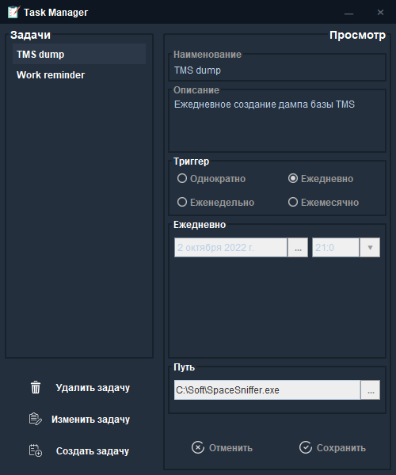
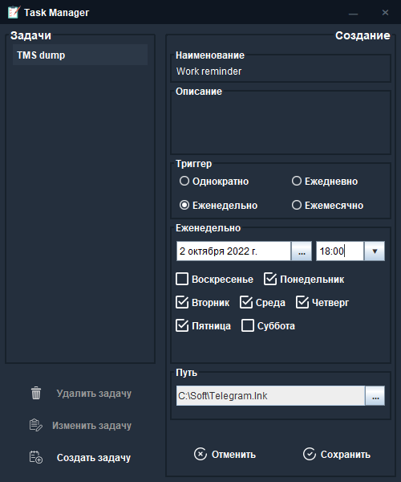
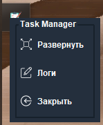

<h1 align="center">Task manager</h1>
<h3 align="center">Better not waste time looking at the code, this project is not worth it</h3>
 
<h6 align="center">Manage and execute files (.exe) for specific period and repeat time</h6>
<h6 align="center">Theoretically multiplatform but tested only on Windows 10</h6>
<h6 align="center">Working with database are raw (using connection & statement)</h6>

# Stack
 - Kotlin - main language
 - Swing - ready UI components
 - Cron x Quartz - job scheduler

# Screenshots

    &emsp;
    &emsp;
    &emsp;

